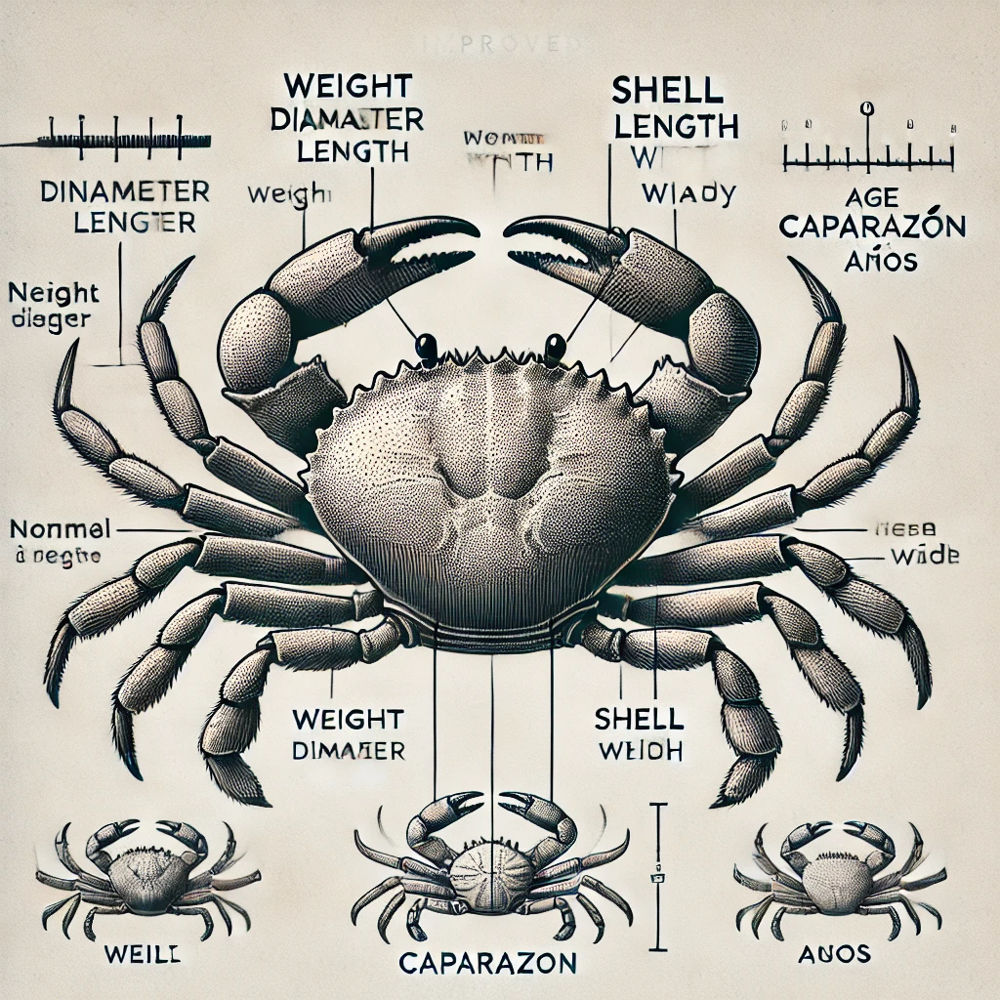
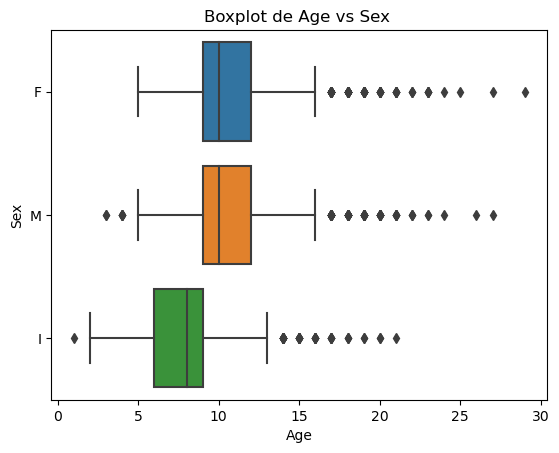

# Analisis Predictivo de la Edad del Cangrejo 🦀

## Comprensión del Negocio

Para un criador comercial de cangrejos, conocer la edad correcta del cangrejo les ayuda a decidir si cosechar los 
cangrejos y cuándo. Más allá de cierta edad, hay un crecimiento insignificante en las características físicas del 
cangrejo y, por lo tanto, es importante cronometrar la cosecha para reducir el costo y aumentar las ganancias.

## Descripción de los Datos

Estos Datos fueron extraidos de la plataforma kaggle [Dataset](https://www.kaggle.com/code/umutcindiloglu/crab-age-prediction).

Este conjunto de datos contiene información sobre diferentes características de los cangrejos. Las variables incluidas son:

Columnas:

    •  Sex: Género del cangrejo (Macho, Hembra, Indeterminado).
    •  Length: Longitud del cangrejo (en pies; 1 pie = 30.48 cm).
    •  Diameter: Diámetro del cangrejo (en pies; 1 pie = 30.48 cm).
    •  Height: Altura del cangrejo (en pies; 1 pie = 30.48 cm).
    •  Weight: Peso del cangrejo (en onzas; 1 libra = 16 onzas).
    •  Shucked Weight: Peso del cangrejo sin cáscara (en onzas; 1 libra = 16 onzas).
    •  Viscera Weight: Peso de las vísceras del cangrejo (en onzas; 1 libra = 16 onzas).
    •  Shell Weight: Peso de la cáscara del cangrejo (en onzas; 1 libra = 16 onzas).
    •  Age: Edad del cangrejo (en meses).

## Objetivos

   • El primer objetivo es identificar cuáles de las variables disponibles (sexo, longitud, diámetro, altura, peso total, peso sin 
   cáscara, peso de las vísceras y peso de la cáscara) tienen una correlación más fuerte con la edad del cangrejo.

   > Al identificar las variables más influyentes en la determinación de la edad, podemos enfocarnos en medir y registrar estas
> variables de manera más
 precisa y eficiente, reduciendo costos operativos.

   • El segundo objetivo es desarrollar un modelo de machine learning que permita predecir la edad de un cangrejo en función de sus 
   características físicas.

   > Un modelo preciso permitirá a los criadores tomar decisiones más informadas sobre cuándo
> cosechar los cangrejos, maximizando así sus ganancias.

## Metodología

* **Recopilación de datos:** Se utilizará el conjunto de datos de Kaggle "crab-age-prediction".
* **Preprocesamiento de datos:** Limpieza, transformación y normalización de los datos.
* **Exploración de datos:** Análisis exploratorio de los datos para identificar patrones y relaciones.
* **Modelado:** Entrenamiento de diferentes modelos de machine learning (regresión lineal, random forest, etc.).
* **Evaluación:** Evaluación de los modelos utilizando métricas como RMSE y R².
* **Deployment:**

## Herramientas

* Python
* Pandas
* NumPy
* Scikit-learn
* Feature-Engine
* Tensorflow

## Cronograma

| Tarea | Fecha de inicio | Fecha de finalización | Path|
|-------|-----------------|-----------------------|-----|
| Analisis Exploratorio   | 28/12/2024 | 10/01/2025|Notebooks/eda_data.ipynb|
| Modelado| 10/01/2025 | 25/01/2025 | Notebooks/modelado.ipynb|

## Equipo 

* **[Diego Sanchez]:**
* **[Andres Martinez]:**
  
---
# ✨ Resultados

## 🟢 Análisis Exploratorio
🦀¿Sabías que la edad de un cangrejo puede estar estrechamente relacionada con características como su longitud, diámetro y peso?

En nuestro análisis exploratorio, descubrimos patrones sorprendentes que podrían ayudarte a entender
 mejor a estos fascinantes crustáceos. Por ejemplo, la siguiente visualización muestra cómo el Sexo del cagrejo puede ser identificado apartir de una cierta edad años:

💡 Si quieres explorar más hallazgos como este y ver cómo llegamos a estas conclusiones, te invitamos a revisar 
el notebook completo de análisis exploratorio aquí.

## 🔶 Modelado
Después de probar diferentes algoritmos de regresión, los mejores resultados se obtuvieron con:

| Modelos | R^2 Entrenamiento | R^2 Validacion |
|-------|-----------------|-----------------------|
| XGBoost  | 0.60 | 0.57|
| Red Neuronal Artificial (ANN)| 0.59 | 0.56 |

> El modelo XGBoost logra explicar el 57% de la variabilidad presente en los datos, lo que representa una capacidad significativa para identificar patrones clave y generar predicciones fiables. Este nivel de precisión puede traducirse en mejores decisiones informadas para el productor, permitiéndole optimizar recursos, reducir incertidumbre y enfocar estrategias en áreas críticas para el negocio.   

Estos modelos demostraron ser los más prometedores para la predicción de la edad del cangrejo, logrando un balance adecuado entre precisión y generalización. Sin embargo, existe espacio para futuras mejoras mediante el ajuste de hiperparámetros más exhaustivo ,técnicas de ensamblado o cambiar el enfoque a un problema de clasificación realizando discretización.
